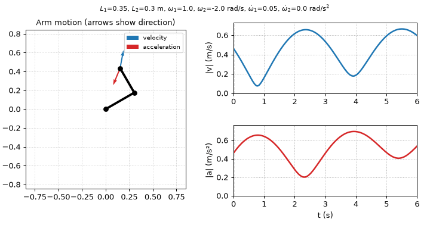

# 2-DOF Arm Kinematics Visualizer
 
Interactive tool that computes and visualizes the wrist position, velocity and acceleration of a planar 2 degree of freedom (2DOF) arm from link lengths, initial shoulder/elbow angular velocities, and shoulder/elbow angular accelerations.
 

 
Figure. Arm motion with wrist velocity (blue) and acceleration (red) direction arrows, alongside |v| and |a| plots over 6 second time range. Animated figure generated via in-repo 'make_gif.py' script.
 
---
 
## Overview
 
This tool computes and animates the wrist velocity and acceleration of a planar two-link (2-DOF) arm. The shoulder is pinned to a fixed base, and each joint has its own angular velocity and constant angular acceleration, with the elbow's motion measured relative to the upper arm.

The problem is purely kinematic, describing the arm's motion and does not consider the forces or torques that produce the  motion. The kinematic model makes it the natural first layer of a robot arm model, and the foundation for dynamics, where joint torques, link masses, and gravity would be then considered.

I built this as a weekend project to apply what I'd learned in my undergraduate Dynamics course. The solver implements a hand derivation from scratch (see docs/2DOF_Kinematics_Derivations.pdf), and the visualizer turns the resulting equations into an animation, making it easy to see how each input shapes the motion.
 
---
 
## Features
 
- Analytic wrist position, velocity, and acceleration over time
- Interactive sliders for $L_1$, $L_2$, $\omega_1$, $\omega_2$, $\dot\omega_1$, $\dot\omega_2$
- Animated arm with wrist vector directions, synced to |v| and |a| plots
- Verification script with sample motion cases and numerical check
---
 
## Model and Assumptions
 
- Rigid links, planar motion, fixed shoulder pin
- Constant angular accelerations
- $\omega_2$, $\dot\omega_2$ measured relative to the upper arm
- Initial pose: upper arm $\theta_1$ = 30° from +x, forearm $\theta_2$ 60° from −x (120° absolute)
- Counterclockwise positive; kinematics only, no forces  

Full derivation: [`docs/2DOF_Kinematics_Technical_Report.pdf`](docs/2DOF_Kinematics_Technical_Report.pdf)
 
---
 
## Key Equations
 
Key equations used in the solver are:
 
$\vec{R}_{W/o} = L_1 \hat{\imath}_s + L_2 \hat{\imath}_e$  

$\vec{V}_{W/o}=L_1\omega_1\hat{\jmath}_s + L_2(\omega_1 + \omega_2)\hat{\jmath}_e$  

$\vec{a}_{W/o} = L_1\dot\omega_1\hat{\jmath}_s -L_1\omega_1^2\ \hat{\imath}_s + L_2(\dot\omega_1+\dot\omega_2)\hat{\jmath}_e -L_2(\omega_1+\omega_2)^2\ \hat{\imath}_e$

 
See [`docs/2DOF_Kinematics_Technical_Report.pdf`](docs/2DOF_Kinematics_Technical_Report.pdf) for more information regarding reference frames (namely unit vector transforms to global frame), notation, and system's time-dependence. 
 
---
 
## Verification

The solver and governing mathematics were tested via three tests found in `verification.py`:  
* Rigid rotation test where there are no angular accelerations, and the only angular velocity is at the shoulder.  
* Fixed shoulder angle test where the only angular velocity/acceleration occurs at the elbow.  
* Finite difference test where numpy numerical differentiation compared to the analytic solutions used by the solver to test derivative relations between wrist position, velocity, and acceleration.  

The following table summarizes some key error results; more comprehensive explanation in section (vii) of [`docs/2DOF_Kinematics_Technical_Report.pdf`](docs/2DOF_Kinematics_Technical_Report.pdf) 

 
| Test | Result |
|---|---|
| Rigid rotation: $\|v\| = \omega_1 r$, $\|a\| = \omega_1^2 r$ | 2.2e-16 $m/s$ ; 2.2e-16 $m/s^2$ |
| Shoulder held still: $\|v\| = L_2\|\omega_2(t)\|$ | 1.1e-16 $m/s$ ; 4.4e-16 $m/s^2$ |
| Finite difference vs. analytic ($\Delta t = 0.001$ s) | 1.5e-6 $m/s$ ; 4.2e-6 $m/s^2$ ; errors drop x4 when $\Delta t$ halved |
 
These tests verify the mathematics and solver for the arm's kinematics model. It would not hold against the real-world case where gravity forces, material properties, etc must be considered.
 
---
 
## Requirements
 
```bash
pip install -r requirements.txt
```
 
All scripts use numpy and/or matplotlib. Key matplotlib submodules include: `animation`, `widgets`, and `pyplot` 
 
---
 
## Usage
 
**Interactive visualizer**
 
```bash
python main.py
```
 
The interactive visualizer serves to let the user change initial conditions (link lengths, angular velocities/accelerations per joint) via sliders to observe the motion of the arm over time. Velocity and acceleration arrows are depicted solely for vector direction, but do not reflect actual magnitudes. The reset button restores initial configuration.
 
**Verification**
 
```bash
python verification.py
```
 
`verification.py` runs solver against three tests; prints PASS/FAIL and error for each test 

 
---
 
## Repository Structure
 
```
2-dof-arm-kinematics/
├── arm_kinematics.py                      [solver]
├── main.py                                [interactive visualizer]
├── verification.py                        [verification checks]
├── make_gif.py                            [leading figure generator]
├── docs/
│   └── 2DOF_Kinematics_Derivations.pdf    [full derivation]
│   └── original_handwritten_notes.pdf     [original on-paper work]
└── figures/
    └── demo.gif                           [GIF for this README]  
```
 
---
 
## License
 
MIT. See [LICENSE](LICENSE).
 